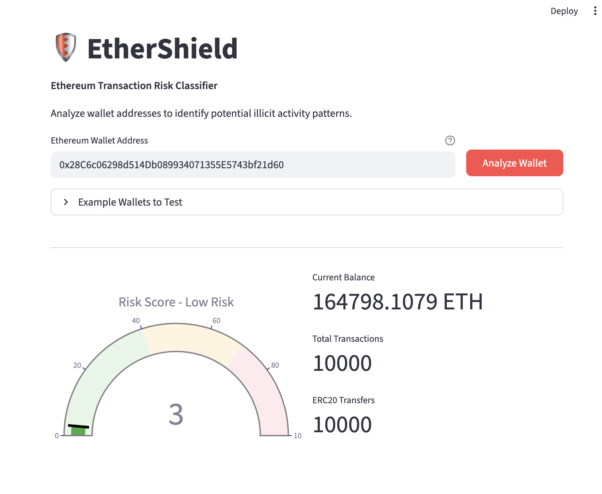
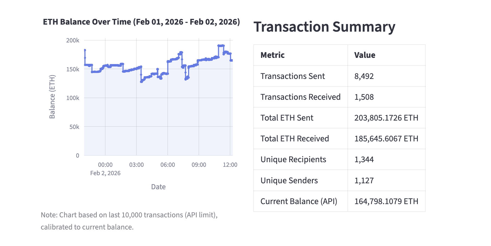

# EtherShield

**Real-Time Ethereum Transaction Risk Classifier**

An ML-powered dashboard that analyzes Ethereum wallet addresses and calculates a "Risk Score" based on transaction history, identifying potential illicit activity such as money laundering, phishing, or bot behavior.

**[Live Demo](https://shareappio-ahlwqgisfysvjdbzehjmky.streamlit.app/)**



## The Problem

Blockchain's transparency is a double-edged sword. While all transactions are public, the sheer volume makes manual analysis impossible. Bad actors exploit this by:
- Layering funds through multiple wallets to obscure origins
- Using automated bots for wash trading or market manipulation
- Running phishing operations that drain victim wallets

EtherShield automates the detection of these patterns using machine learning trained on known fraud cases.

## What It Does

EtherShield helps identify suspicious Ethereum wallets by analyzing their on-chain transaction patterns. Enter any wallet address, and within seconds you'll receive:

- **Risk Score (0-100)**: An instant assessment of how likely the wallet is involved in fraudulent activity
- **Balance History**: Visual chart showing ETH balance changes over time
- **Transaction Summary**: Key metrics including total sent/received, unique counterparties, and ERC-20 token activity
- **Explainability Report**: Understand *why* a wallet was flagged, with the specific factors contributing to the score



## How It Works

1. **Data Collection**: Fetches real-time transaction data from the Etherscan API
2. **Feature Engineering**: Extracts 15+ behavioral signals (transaction frequency, value distributions, counterparty diversity, etc.)
3. **ML Prediction**: XGBoost classifier scores the wallet based on patterns learned from 10,000+ labeled fraud cases
4. **Explainability**: SHAP values reveal which factors most influenced the prediction

## Risk Levels

| Score | Level | Interpretation |
|-------|-------|----------------|
| 0-39 | Low Risk | Normal transaction patterns |
| 40-69 | Medium Risk | Some unusual patterns detected |
| 70-100 | High Risk | Strong indicators of suspicious activity |

## Tech Stack

| Category | Technologies |
|----------|-------------|
| **Machine Learning** | XGBoost, scikit-learn, SMOTE (imbalanced-learn), SHAP |
| **Backend** | Python, aiohttp, tenacity |
| **Frontend** | Streamlit, Plotly |
| **Blockchain Data** | Etherscan API |
| **Configuration** | Pydantic Settings |

## Project Structure

```
eth-classifier/
├── app/                    # Streamlit dashboard
│   ├── main.py
│   └── components/         # UI components (gauge, charts, panels)
├── src/
│   ├── etherscan/          # API client & data transformation
│   ├── ml/                 # Model training, prediction, SHAP explainer
│   └── data/               # Feature engineering pipeline
├── models/trained/         # Serialized model files
├── scripts/                # Training scripts
└── tests/                  # Unit tests
```

## Quick Start

### Prerequisites
- Python 3.11+
- [Etherscan API Key](https://etherscan.io/apis) (free tier works)

### Installation

```bash
# Clone the repository
git clone https://github.com/simplysindy/ethershield 
cd ethershield

# Install dependencies
uv sync

# Configure environment
cp .env.example .env
# Add your ETHERSCAN_API_KEY to .env
```

### Training the Model

Download the [Ethereum Fraud Detection Dataset](https://www.kaggle.com/datasets/vagifa/ethereum-frauddetection-dataset) from Kaggle and place `transaction_dataset.csv` in `data/raw/`.

```bash
uv run python scripts/train_model.py
```

### Running the Dashboard

```bash
uv run streamlit run app/main.py
```

Open http://localhost:8501 in your browser.

### Running Tests

```bash
uv run pytest tests/ -v
```

## License

[MIT](LICENSE)
